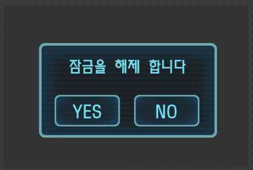
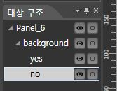

팝업 윈도우 띄우기
====

이번에는 게임 화면 위에 팝업 윈도우를 띄워보도록 하겠습니다.<br>

CocoStudio에서 작업하기
----
가장 먼저 해야 할 일은 CocoStudio에서 팝업 윈도우의 레이아웃을 구성하는 것 입니다.<br>
<br>
새 캔버스 만들기 버튼을 눌러 새로운 캔버스를 만들고 이름을 원하는 이름으로 변경합니다.
<br>
그 다음 컨트롤들을 배치하여 아래와 같은 레이아웃을 구성합니다.
<br><br>

<br>

<br>
마지막으로 익스포트한 후, 결과물들을 res폴더로 복사합니다.
<br>

코드에 적용시키기
----
새로운 리소스가 추가되었으니 __src/resource.js__를 수정해야 합니다.
```js
var res = {
	scene : "res/scene.json", // 씬 캔버스의 json
	popup : "res/popup.json", // 팝업 캔버스의 json
	/* ... 이하생략  */
};
```
그 다음 __src/app.js__로 이동하여 실제로 팝업을 띄우는 코드를 작성합니다.<br>
여기에서는 버튼이 눌리면 팝업이 뜨도록 작성해보겠습니다.
```js
onButtonClick:function(){
  /* 팝업 레이아웃을 읽어와서 */
	var popup = ccs.uiReader.widgetFromJsonFile("res/popup.json");
  
  /* 원래의 씬에 자식 노드로 추가합니다. */
	_this.addChild(popup);
}
```
