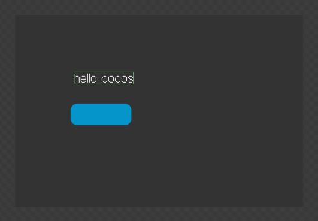
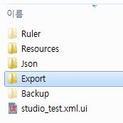
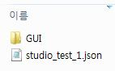

CocoStudio에서 작업한 결과물을 불러오기
====



파일 -> 프로젝트 내보내기 -> 확인


<br>
CocoStudio의 Export/프로젝트_이름 폴더에 들어가서 안의 파일들을<br>
게임 프로젝트의 res/ 폴더에 복사.



__project.json__<br>
modules의 cocos2d 옆에 cocostudio를 추가
```json
"modules" : ["cocos2d", "cocostudio"]
```

__src/resource.js__
```js
var res = {
	test : "res/파일_이름.json"
};
```
__src/app.js__
```js
ctor:function(){
  this._super();
  
  var node = ccs.uiReader.widgetFromJsonFile("res/파일_이름.json");
  this.addChild(node);
  
  return true;
}
```
