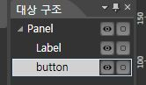
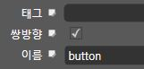

버튼이 눌렸을 때 반응하기
====

먼저 CocoStudio에서 배치했던 컨트롤들 중 클릭 이벤트를 받을 버튼을 찾야아 합니다.<br>
에디터에서 버튼의 이름을 'button' (혹은 원하는 이름)(대소문자 구분)으로 바꾼 후 다시 저장합니다.<br>



위와 같은 계층 구조에서 최상단에 있는 Panel이 이전에 추가했던 node입니다.<br>
node의 아래층에 있는 button을 찾으려면 __getChildByName__메소드를 사용해야 합니다.

__src/app.js__<br>
아래의 코드는 getChildByName메소드를 사용해서 'button'인 항목을 찾는 코드입니다.
```js
var button = node.getChildByName("button");
```
<br>
버튼을 찾았으면 이제 버튼에 ClickEventLisnter를 등록해야 합니다.<br>

__src/app.js__
```js
button.addClickEventListener(function(){
  /* 여기에 버튼을 눌렀을 때 하고 싶은 코드 작성 */
	console.log("버튼 눌렸다.");
});
```

<br><br><br>

* 한글이 깨져서 나올 때는 파일을 utf-8로 저장하여야 합니다.
* 버튼을 눌러도 동작하지 않는 경우<br>
  <br>
  버튼의 속성 중 __'쌍방향'__ 항목에 체크해 주세요
