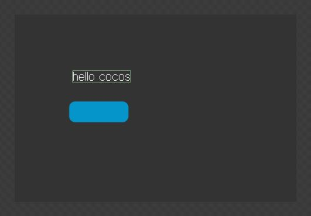

컨트롤들의 속성 변경하기
====

<br>
<br>
여기서는 컨트롤의 위치, 투명도, 스케일을 조절하는 방법을 다루겠습니다.<br>
이번에는 버튼이 아닌 라벨로 작업합니다.<br>

먼저 CocoStudio에서 라벨의 이름을 'label'(또는 원하느 이름)로 바꿔서 저장합니다.<br>
<br>
__src/app.js__<br>
다음으로 버튼을 찾을 때와 같은 방법으로 getChildByName메소드로 라벨을 가져옵니다.
```js
var label = node.getChildByName("label");
```

스케일 변경하기
----
setScale메소드로 스케일을 변경할 수 있습니다.
```js
label.setScale(2); // 가로,세로 2배 커짐
label.setScale(1.5, 3); // 가로는 1.5배, 세로는 3배 커짐

/* setScaleX, setScaleY로 가로 또는 세로의 스케일만 변경할 수 있습니다. */
label.setScaleX(5); // 가로를 5배로
label.setScaleY(2); // 세로를 2배로
```

보이는 상태 변경하기
----
setVisible메소드로 보이는 상태를 변경할 수 있습니다.<br>
컨트롤을 안보이게 하거나, 다시 보이도록 할 때 사용합니다.<br>
만약에 컨트롤을 완전히 안보이게 하고 싶을 때에는 투명도를 0으로 변경하는것보다 setVisible로 상태를 변경하는것이 좋습니다.
```js
label.setVisible(true); // 보이도록
label.setVisible(false); // 안보이도록
```

투명도 변경하기
----
setOpacity메소드로 투명도를 조절할 수 있습니다.<br>
투명도는 0~255사이의 값으로 0에서 완전 투명하고 255에서 완전 불투명합니다.
```js
label.setOpacity(0); // 완전 투명 상태로
label.setOpacity(128); // 반투명 상태로
label.setOpacity(255); // 완전 불투명 상태로
```

위치 변경하기
----
setPosition메소드로 위치를 변경할 수 있습니다.<br>
위치는 좌측 하단이 (0,0)좌표입니다.
```js
label.setPosition(100,100); // (100,100)좌표로 이동

/* setPositionX, setPositionY로 x,y좌표 각각을 설정할 수도 있습니다. */
label.setPositionX(100); // x만 100으로 이동
label.setPositionY(200); // y만 100으로 이동
```
