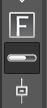
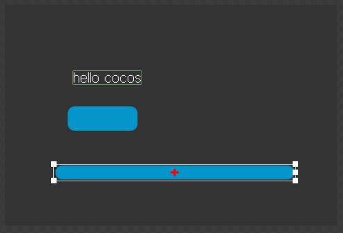
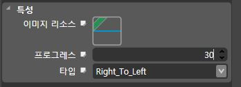

프로그래스 바 사용하기
====

프로그래스바를 사용하는 방법에 대해서 배웁니다.<br>
프로그래스 바는 주로 진행 상황을 나타낼 때 사용합니다.


먼저 CocoStudio의 캔버스에 프로그래스 바를 추가합니다.



속성 창의 속성을 변경하여 프로그래스바의 상태를 변경할 수 있습니다.

* 프로그래스 : 0~100사이의 값으로, 100일때 가득 찬 상태고 0일때 비워진 상태입니다.
* 타입 : 프로그래스 방향을 결정합니다. 좌->우 또는 우->좌

코드에서 사용할 수 있도록 이름을 변경하고 publish후 복사합니다.

프로그래스바의 수치 변경하기
----
setPercent함수를 사용하여 프로그래스 바의 채움의 정도를 변경할 수 있습니다.
```js
var progress = node.getChildByName("progress_bar");

/* 반만 채우도록 */
progress.setPrecent(50);
```
setPrecent함수에 인자로 넣어야 하는 숫자는 %수치입니다.<br>
대부분의 경우에는 %를 직접 계산해서 넘겨주어야 합니다.
```js
/* 2/5만큼 채우고 싶을 때 */
var percent = (2/5) * 100;
progress.setPercent(percent);
```
