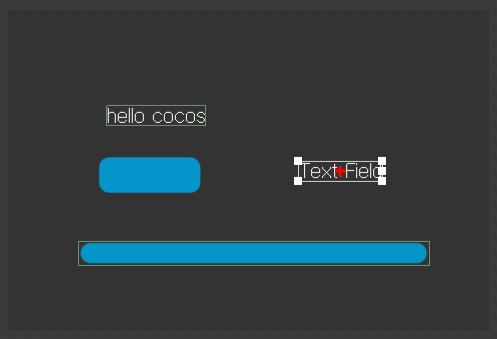
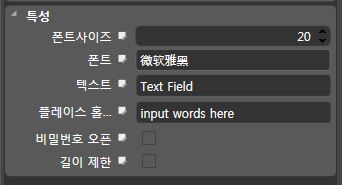

텍스트 필드 사용하기
====

텍스트 필드는 문자 입력을 받기 위한 컨트롤입니다.

CocoStudio에서 텍스트 필드 추가하기
----
TextField컨트롤을 원하는 위치에 추가합니다.<br>

<br>

속성 창의 속성을 필요에 맞게 변경합니다.<br>
<br>
* __플레이스 홀더__ : 아무것도 입력하지 않았을 때 기본적으로 보이는 텍스트입니다.
  * 예) '여기에 아이디를 입력하세요'
* __비밀번호__ : 체크할 경우 문자열이 __*__또는 지정한 문자로 대체되어 보여집니다.
* __길이 제한__ : 입력받을 길이를 제한할 수 있습니다.

마지막으로 코드에서 사용할 수 있도록 알맞게 이름을 변경한 후 publish합니다.

텍스트 가져오기/설정하기
----
라벨과 동일하게 setString/getString 메소드를 이용하여 텍스트를 설정하고, 가져올 수 있습니다.
```js
var text = node.getChildByName("text_field");

/* 입력된 텍스트를 가져와서 출력합니다. */
alert( text.getString() );
```
```js
/* 텍스트를 hello로 설정 */
text.setString("hello");
```

강제로 입력 받도록 하기
----
기본적으로 텍스트 필드는 컨트롤을 눌러야 입력할 수 있지만, 강제로 입력받는 상태로 만들어 줄 수도 있습니다.<br>
(로그인 화면에서 아이디 입력창을 누르지 않아도 바로 포커스를 주고 싶을 때)
```js
/* 강제로 입력 받는 상태로 만듭니다. */
text.attachWithIME();
```
