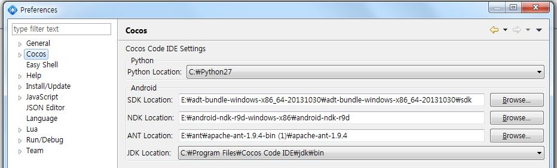
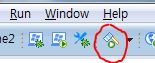
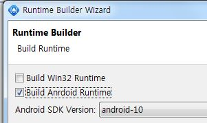

APK 빌드하기
====

제작한 게임을 안드로이드 앱(apk)으로 내보내는 방법을 알아봅니다.

필요한 파일들 다운받기
----
* [python](https://www.python.org/downloads/release/python-278/)
* [ndk n9d](http://dl.google.com/android/ndk/android-ndk-r9d-windows-x86.zip)
* [Android SDK](https://dl.google.com/android/android-sdk_r24.0.2-windows.zip)
* [ANT](http://mirror.apache-kr.org//ant/binaries/apache-ant-1.9.4-bin.zip)

각각의 파일들을 받아서 압축을 푼 후 적당한 폴더에 위치시킵니다. 
(파이썬의 경우에는 설치해야 합니다.)

Cocos IDE 설정하기
----
Cocos IDE를 실행하고 Windows -> Preferences -> Cocos탭에 들어갑니다. 
 
위와 같은 창이 뜨면 이전에 다운받은 각각의 항목들의 경로를 올바르게 설정해줍니다. 
__Apply__버튼을 누르고 OK를 눌러서 창을 닫습니다.

APK 빌드하기
----
설정이 끝났으니 apk를 빌드하는 일만 남았습니다. 
Cocos IDE 상단의 메뉴 중 __Build Runtime__아이콘을 클릭합니다. 
  
빌드 마법사 창이 나오면 아래 그림과 같이 __Build Android Runtime__항목에 체크합니다. 
 
__Generate__버튼을 누르면 빌드가 시작되며 결과가 표시됩니다.  
(첫 번째 빌드일 경우에는 약 5분 이상의 시간이 소요될 수 있습니다.)  
빌드가 성공했을 경우에 프로젝트 폴더의 __runtime/android__폴더에 들어가면 apk가 생성된 것을 볼 수 있습니다.
